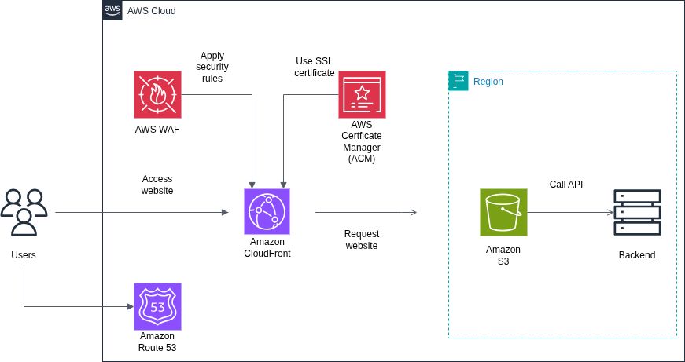

# AWS Cloud Portfolio: Project 1 - Secure Static Website Hosting

## Overview
This project demonstrates a production-ready infrastructure for hosting a static website on AWS. It utilizes a Serverless architecture to ensure high availability, global performance, and security.

The infrastructure is defined as code using **Terraform** and deployed locally using **LocalStack** to simulate the AWS environment

## Architecture
- **Amazon S3**: Hosting static HTML/CSS assets.
- **Amazon CloudFront**: Content Delivery Network (CDN) for low-latency global delivery.
- **AWS WAF**: Web Application Firewall to protect against common exploits.
- **AWS ACM**: Certificate Manager for SSL/TLS termination.
- **Amazon Route 53**: DNS management for custom domain routing.



## Technology Stack
- **IaC**: Terraform
- **Cloud Simulation**: LocalStack
- **Scripting**: Bash
- **Frontend**: HTML5/CSS3

## Prerequisites
- Docker & Docker Compose
- Terraform
- LocalStack CLI / `terraform-local` wrapper (`pip install terraform-local`)

## Setup & Deployment

1. **Start LocalStack:**
    ```
    docker-compose up -d
    ```

2. **Deploy Infrastructure:**
    ```
    ./scripts/deploy.sh
    ```

3. **Access the Website:**
    ```
    s3_bucket_website_endpoint
    ```
    Open this URL in your browser to view the deployed site.
